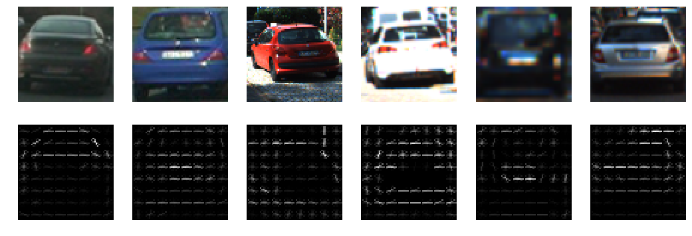
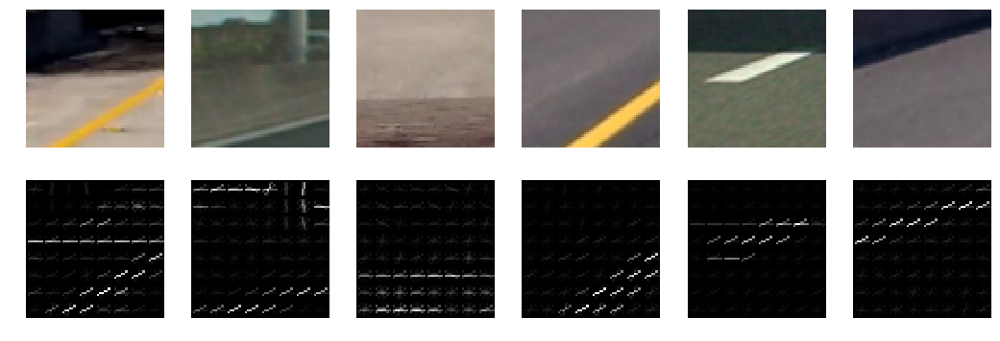
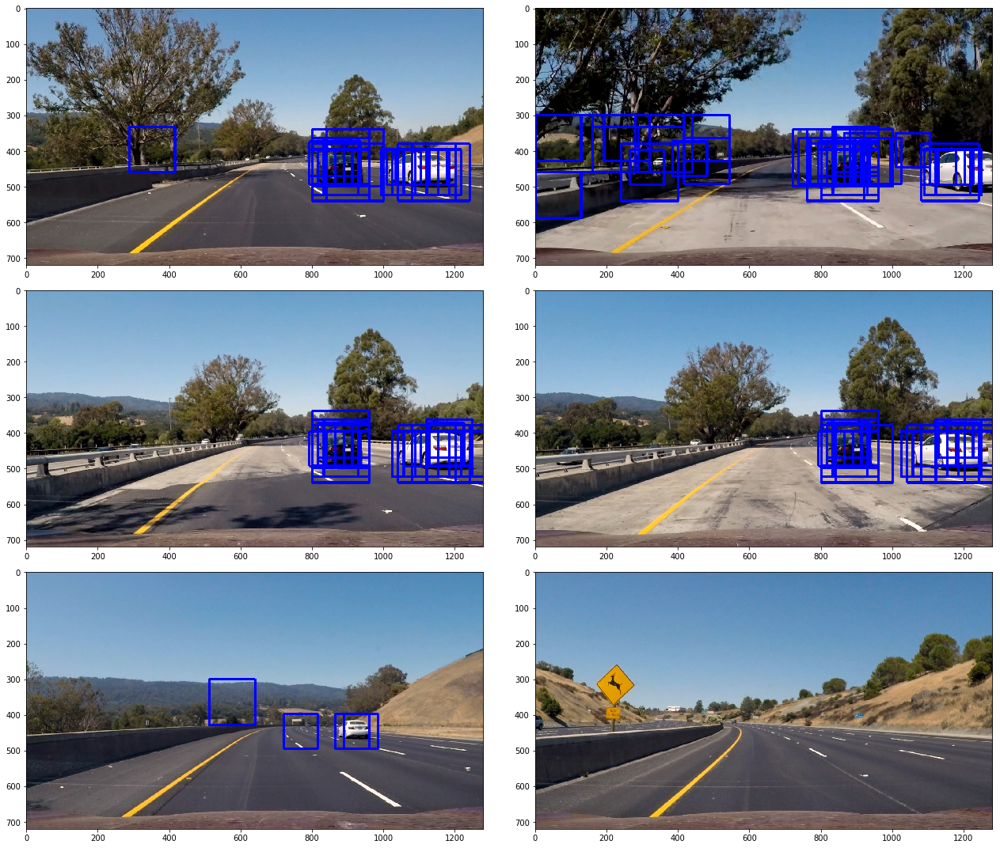
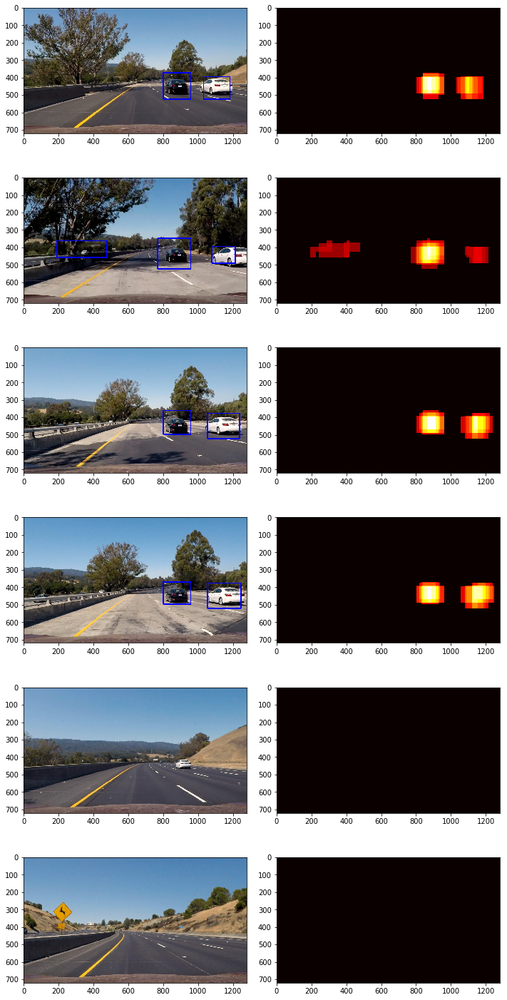

## Advanced Lane Finding Project

### Histogram of Oriented Gradients (HOG)

#### 1. Explain how (and identify where in your code) you extracted HOG features from the training images.

The code for this step is contained in the second chapter _"2. Extract HOG features"_ of IPython notebook.

I started by reading in all the `vehicle` and `non-vehicle` images. I then explored different color spaces and different `skimage.hog()` parameters (`orientations`, `pixels_per_cell`, and `cells_per_block`).  I grabbed random images from each of the two classes and displayed them to get a feel for what the `skimage.hog()` output looks like.

Here is an vehicles example HOG parameters of `orientations=9`, `pixels_per_cell=(8, 8)` and `cells_per_block=(2, 2)`:

and non vehicles with same parameters:

#### 2. Explain how you settled on your final choice of HOG parameters.

I tried various combinations of parameters manually, quickly got close to 99% performance with test data by using following parameters:

| Parameter             |     Value     | 
|:---------------------:|:-------------:| 
| Color space           | YCrCb 		| 
| HOG orientations     	| 11 	        |
| pixels per cell    	| 8x8 	        |
| cells per block    	| 2x2 	        |
| HOG channels    	    | ALL	        |
| spatial size    	    | 32x32	        |
| histogram bins    	| 11	        |
| spatial features    	| on	        |
| histogram features    | on	        |
| HOG features    	    | on	        |
 
 
After fully implementing pipeline, I found out that although some parameter combinations gave good test performance, they didn't work that well while detecting vehicle on videos, so had to do some additional tuning afterwards to get better result. 

### Sliding Window Search

#### 1. Describe how (and identify where in your code) you implemented a sliding window search.  How did you decide what scales to search and how much to overlap windows?

I tried different sliding window combinations (`ystart`, `ystop`, `scale`), checked output images and detected vehicles (rectangles) count and then tried to minimize window count needed as this had big impact on performance.

I dropped scale 1.0  as this only detected cars that were already detected by bigger scale sizes, so added unnecessary performance penalty. Vehicles far away that should have been detected by this scale, were not detected anyway, probably because the resolution gets too low.

I dropped also scales 3.0 and bigger as these didn't detect any vehicles on test images. 

Sliding windows used:

| y start   | y end |   scale | 
|:---------:|:-----:| -------:|
| 350       | 500   | 1.5     | 
| 300     	| 600 	|2.0      | 
| 300    	| 650 	|2.5 	  | 

#### 2. Show some examples of test images to demonstrate how your pipeline is working.  What did you do to optimize the performance of your classifier?

Ultimately I searched on 3 scales using YCrCb 3-channel HOG features plus spatially binned color and histograms of color in the feature vector.  Here are some example images:

---

### Video Implementation

#### 1. Provide a link to your final video output.  Your pipeline should perform reasonably well on the entire project video (somewhat wobbly or unstable bounding boxes are ok as long as you are identifying the vehicles most of the time with minimal false positives.)

Here's a [link to test video result](./test_video_out.mp4)

Here's a [link to project video result](./project_video_out.mp4)

#### 2. Describe how (and identify where in your code) you implemented some kind of filter for false positives and some method for combining overlapping bounding boxes.

I recorded the positions of positive detections in each frame of the video. From the positive detections I created a heatmap and then thresholded that map to identify vehicle positions.  I then used `scipy.ndimage.measurements.label()` to identify individual blobs in the heatmap.  I then assumed each blob corresponded to a vehicle.  I constructed bounding boxes to cover the area of each blob detected.  

Do better avoid false positives I also stored positive detections of last 10 frames and used this data to generate heatmaps so that vehicles detected only in one or two frames would be excluded.

Here is test images heat maps:

---

### Discussion

#### 1. Briefly discuss any problems / issues you faced in your implementation of this project.  Where will your pipeline likely fail?  What could you do to make it more robust?

I think biggest problem currently is that as the processing speed is very slow, one magnitude slower than needed real time processing.

Pipeline currently also fails to detect car far away, although these are still easily distinguishable for human eye.

Also there is still some false positives like advertising billboards that are sometimes detected as vehicles.